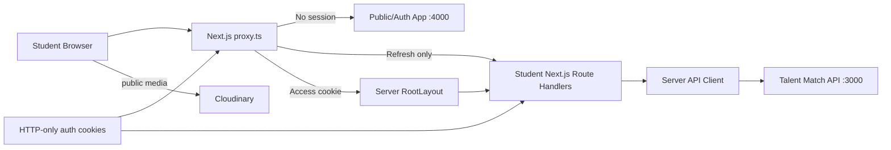
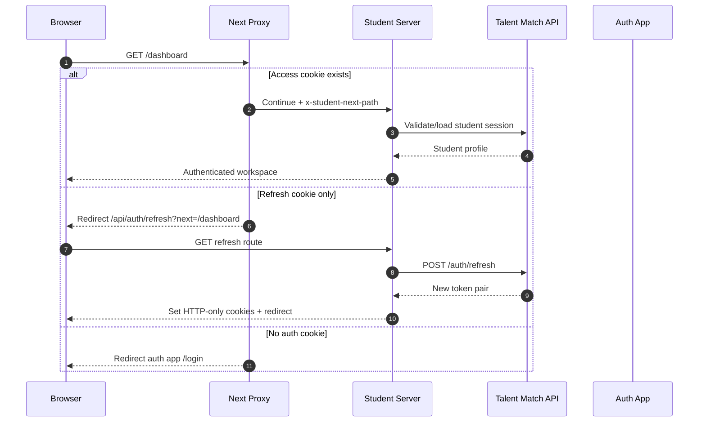
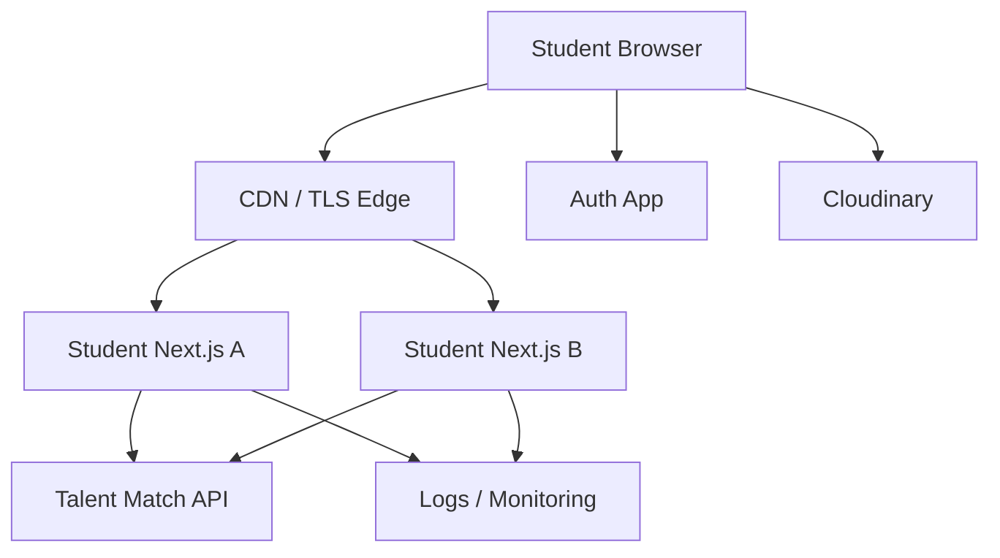

<div align="center">

# Talent Match Student V2

### Secure, role-scoped student workspace for opportunities, applications, profile management, and the Talent Match student journey

[](#technology-stack)
[](#technology-stack)
[](#overview)
[](#authentication-and-session-model)
[](#current-status)

**Talent Match Student V2** is the authenticated student portal for Talent Match Africa. It provides the student-facing workspace while delegating authoritative authentication, authorization, business rules, and persistence to the Talent Match API.

[Overview](#overview) ·
[Architecture](#architecture) ·
[Authentication](#authentication-and-session-model) ·
[Workspace](#student-workspace) ·
[API](#api-integration) ·
[Setup](#local-development) ·
[Security](#security-model)

</div>

---

> [!IMPORTANT]
> This application is a **student frontend**, not the authoritative security boundary. Backend authorization must remain enforced by the Talent Match API even when the frontend hides or disables an action.

> [!IMPORTANT]
> Authentication tokens are stored in server-managed HTTP-only cookies and proxied to the Talent Match API from server-side code. Do not move access or refresh tokens into `localStorage`, query strings, or client-readable JavaScript state.

> [!NOTE]
> This documentation is based on the repository files that were publicly retrievable during this review. Several source files were unavailable through the public mirror, so exact student-domain page coverage, package versions, tests, and CI details are explicitly marked where they still require repository reconciliation.

---

## Table of contents

- [Overview](#overview)
- [Current status](#current-status)
- [Application responsibilities](#application-responsibilities)
- [What this application must not own](#what-this-application-must-not-own)
- [Architecture](#architecture)
- [Runtime request flow](#runtime-request-flow)
- [Technology stack](#technology-stack)
- [Repository structure](#repository-structure)
- [Student workspace](#student-workspace)
- [Layout and navigation](#layout-and-navigation)
- [Authentication and session model](#authentication-and-session-model)
- [Cookie model](#cookie-model)
- [Route protection](#route-protection)
- [Session refresh](#session-refresh)
- [Logout](#logout)
- [Auth profile contract](#auth-profile-contract)
- [API integration](#api-integration)
- [Backend error handling](#backend-error-handling)
- [Media handling](#media-handling)
- [Environment configuration](#environment-configuration)
- [Local development](#local-development)
- [Build and production](#build-and-production)
- [Testing and quality](#testing-and-quality)
- [Security model](#security-model)
- [Accessibility](#accessibility)
- [Performance](#performance)
- [Deployment](#deployment)
- [Operations and observability](#operations-and-observability)
- [Known implementation notes](#known-implementation-notes)
- [Hardening roadmap](#hardening-roadmap)
- [Troubleshooting](#troubleshooting)
- [Contributing](#contributing)
- [License](#license)

---

## Overview

Talent Match Student V2 is an authenticated workspace dedicated to the `STUDENT` role.

The root layout:

- declares the product as **Talent Match Student**;
- describes the portal as a place to discover opportunities and manage the student journey;
- prevents search-engine indexing and following;
- resolves the intended student path from an internal request header;
- requires a student session before rendering the workspace;
- supplies the authenticated profile to the shared application shell.

The student shell provides:

- responsive sidebar navigation;
- a student top navigation bar;
- authenticated profile context;
- profile access;
- secure logout;
- shared toast notifications;
- a consistent main content area.

### Local service topology

| Service | Default local URL | Responsibility |
|---|---|---|
| Student portal | `http://localhost:4002` | This application |
| Public/Auth app | `http://localhost:4000` | Login and authentication entry |
| Talent Match API | `http://localhost:3000` | Authoritative backend |
| Internal API base | `http://localhost:3000/api` | Server-side requests from this app |
| Cloudinary media base | `https://res.cloudinary.com/talent-match/image/upload` | Public media rendering |

---

## Current status

### Source-confirmed foundation

The repository currently exposes a clear V2 frontend foundation:

- Next.js App Router conventions;
- TypeScript;
- authenticated root layout;
- responsive student workspace shell;
- sidebar and top-navigation components;
- typed public authentication profile;
- cookie-backed access and refresh tokens;
- route interception through `src/proxy.ts`;
- automatic session refresh;
- secure logout bridge;
- server-side API client;
- safe API error normalization;
- public media base configuration.

### Coverage requiring reconciliation

The public mirror did not expose every requested source file. Before treating this README as a complete route catalog, inspect:

- student sidebar constants;
- dashboard page;
- jobs/opportunities pages;
- internships pages;
- applications pages;
- profile forms;
- counseling/appointment pages;
- resources/notifications pages;
- tests;
- package versions;
- CI workflow;
- production deployment manifest.

---

## Application responsibilities

The student portal should own:

- student-facing rendering;
- navigation and page composition;
- form state and field-level user feedback;
- safe browser interactions;
- server-side session bridging;
- student API request orchestration;
- loading, empty, success, and error states;
- accessible responsive UI;
- public media rendering;
- frontend telemetry that excludes sensitive data.

The portal may surface student workflows such as:

- profile management;
- opportunity discovery;
- job and internship discovery;
- applications;
- application status;
- counseling and appointments;
- resources;
- notifications.

Only source-confirmed pages should be documented as implemented.

---

## What this application must not own

The frontend must not own:

- password verification;
- token issuance;
- role authorization;
- ownership authorization;
- application workflow transitions;
- opportunity eligibility rules;
- database access;
- Prisma or database migrations;
- SMTP credentials;
- Cloudinary API secrets;
- backend-only environment secrets;
- trusted calculation of analytics;
- permanent copies of access/refresh tokens in browser storage.

### Security boundary

```text
Browser UX
    ↓
Student Next.js server boundary
    ↓
Talent Match API
    ↓
Database and backend services
```

The API remains authoritative.

---

## Architecture



### Browser/server split

Browser components manage:

- sidebar state;
- menus;
- dialogs;
- visual interaction;
- navigation;
- user-triggered logout.

Server-side code manages:

- access-token cookie reads;
- refresh-token cookie reads;
- refresh calls;
- backend authorization headers;
- logout calls;
- session redirects;
- setting and clearing auth cookies.

---

## Runtime request flow



---

## Technology stack

### Source-confirmed

| Area | Technology |
|---|---|
| Framework | Next.js |
| Language | TypeScript |
| UI | React |
| Routing | Next.js App Router |
| Styling | CSS Modules / global CSS conventions |
| Conditional classes | `clsx` |
| Icons | `@hugeicons/core-free-icons` |
| Images | `next/image` |
| Server API transport | native `fetch` |
| Authentication storage | HTTP-only cookies |
| API backend | Talent Match API |
| Media | Cloudinary public base |

### Versions

Exact versions should be read from the repository’s `package.json` once accessible.

Do not infer versions from framework syntax alone.

---

## Repository structure

Source-confirmed paths include:

```text
src/
├── app/
│   ├── api/
│   │   └── auth/
│   │       ├── logout/
│   │       │   └── route.ts
│   │       └── refresh/
│   │           └── route.ts
│   ├── layout.tsx
│   └── globals.css
├── components/
│   ├── layout/
│   │   ├── StudentSidebar.tsx
│   │   ├── StudentTopNav.tsx
│   │   └── StudentWorkspaceShell.tsx
│   └── shared/
├── endpoints/
│   └── auth/
│       ├── logout.ts
│       └── refresh.ts
├── lib/
│   ├── api-client.ts
│   ├── api-error.ts
│   ├── auth-cookies.ts
│   ├── env.ts
│   ├── session-response.ts
│   └── student-session.ts
├── types/
│   └── auth.ts
└── proxy.ts
```

Additional student-domain directories should be added to this section after source reconciliation.

---

## Student workspace

The workspace shell receives a typed `PublicAuthProfile` and renders:

- the student sidebar;
- a mobile navigation overlay;
- the top navigation;
- the active page inside `<main>`.

Responsive UI state stays client-side.

No authentication token is passed into the shell.

---

## Layout and navigation

### Root metadata

The app declares:

```text
Talent Match Student
```

with page title template:

```text
%s | Talent Match Student
```

and disables indexing/following.

### Sidebar

The sidebar:

- links the Talent Match brand to `/dashboard`;
- derives active state from the current pathname;
- supports desktop collapse;
- supports mobile open/close;
- stores only the sidebar presentation preference in local storage under:

```text
tm_student_sidebar_state
```

The source explicitly notes that this preference contains no session information.

### Top navigation

The top navigation:

- displays the active student section;
- renders the authenticated student profile;
- exposes “Manage profile”;
- exposes “Sign out”;
- provides accessible keyboard/outside-click behavior for the profile menu;
- uses a confirmation dialog before logout.

---

## Authentication and session model

The student application is not the credential issuer.

It consumes token pairs shaped as:

```ts
interface AuthTokenPair {
  access: string;
  refresh: string;
  accessExpiresAt: string;
  refreshExpiresAt: string;
}
```

The server stores these values in HTTP-only cookies.

The frontend proxy decides whether to:

- continue;
- attempt refresh;
- send the student to the auth application.

The root layout then calls the student-session requirement before rendering protected content.

> [!IMPORTANT]
> The proxy’s presence check is not cryptographic token validation. Backend/session validation must still occur before protected data is returned.

---

## Cookie model

Default cookie names:

```text
tm_access
tm_refresh
```

Cookie attributes set by the application:

```text
HttpOnly = true
SameSite = Lax
Path = /
Priority = High
Secure = configured / production-aware
Domain = configured only when appropriate
Expires = backend token expiry
```

### Local development

For localhost, the cookie domain is omitted.

### Production

`AUTH_COOKIE_SECURE` defaults to secure behavior when `NODE_ENV=production` unless explicitly overridden.

Production should set:

```dotenv
AUTH_COOKIE_SECURE=true
```

and use HTTPS only.

---

## Route protection

`src/proxy.ts` intercepts application navigation while allowing:

- `/_next`;
- `/api`;
- `/favicon.ico`;
- public files.

For application pages:

### Access cookie present

The request continues and the proxy adds:

```text
x-student-next-path
```

to the server request headers.

### Refresh cookie only

The request redirects to:

```text
/api/auth/refresh
```

with the requested path.

### No auth cookies

The request redirects to the auth app:

```text
/login
```

with:

```text
reason=student_session_required
```

and the intended `next` path.

---

## Session refresh

The refresh route:

1. safely parses the requested return path;
2. reads the refresh cookie server-side;
3. calls backend `/auth/refresh`;
4. validates that the backend response contains a complete token pair;
5. stores new auth cookies;
6. redirects back to the student app.

### Safe return paths

The implementation rejects:

- external origins;
- `/api` destinations;
- `/login`.

Invalid values fall back to:

```text
/dashboard
```

This prevents the refresh flow from becoming an open redirect.

### Expired session

When refresh fails, the route:

- clears both auth cookies;
- redirects to the auth app;
- sets:

```text
reason=student_session_expired
```

---

## Logout

The client posts to:

```text
POST /api/auth/logout
```

The server:

1. reads access and refresh cookies;
2. calls backend `/auth/logout` when an access token exists;
3. if needed, attempts refresh and then logout using the new access token;
4. clears local auth cookies;
5. returns a no-store JSON response.

After success, the browser redirects to the auth app:

```text
/login?reason=signed_out
```

The logout dialog explicitly tells users that the current session is revoked and secure browser cookies are removed.

---

## Auth profile contract

The student UI currently understands these Talent Match roles:

```text
ADMIN
STUDENT
UNIVERSITY
EMPLOYER
TRAINER
COUNSELOR
```

The public profile contract includes:

```ts
interface PublicAuthProfile {
  id: string;
  name: string;
  email: string | null;
  username: string | null;
  phoneNumber: string | null;
  role: TalentMatchRole;
  image: string | null;
  createdAt: string;
  redirect?: RedirectTarget;
  profile?: {
    type: string;
    displayName: string;
    redirect: RedirectTarget;
    details: Record<string, unknown>;
  };
}
```

The student shell uses `displayName`, `name`, then `email` as display-name fallbacks.

### Authorization warning

A typed `role` in the frontend is not enough to authorize a student action.

The API must verify the authenticated actor and relevant resource ownership.

---

## API integration

All backend requests are constructed from:

```dotenv
API_INTERNAL_URL=http://localhost:3000/api
```

The API client:

- sends `Accept: application/json`;
- sends `Content-Type: application/json` for JSON bodies;
- adds `Authorization: Bearer <access-token>` only when supplied server-side;
- uses `cache: "no-store"`;
- supports JSON requests;
- supports `FormData` uploads;
- normalizes backend errors;
- converts network failures into a `503` response shape.

### JSON helper

Supported methods:

```text
GET
POST
PATCH
DELETE
```

### File uploads

`backendFormData()` intentionally does not set the multipart `Content-Type` manually, allowing `fetch` to generate the multipart boundary.

---

## Backend error handling

The application defines a safe API error layer.

Supported fallback messages include:

| Status | Student-facing fallback |
|---|---|
| `400` | Review submitted information |
| `401` | Student session expired |
| `403` | Account cannot perform the student action |
| `404` | Requested information unavailable |
| `409` | Conflict with latest record state |
| `413` | File too large |
| `422` | Submitted information invalid |
| `429` | Too many requests |
| `500` | Request could not be processed |
| `503` | Talent Match temporarily unavailable |

The frontend suppresses backend messages that appear to expose implementation details such as:

- Prisma;
- SQL;
- stack traces;
- database details;
- exceptions;
- localhost ports;
- `node_modules`.

This is useful defense in depth. The backend must still produce safe errors itself.

---

## Media handling

The local environment defines:

```dotenv
NEXT_PUBLIC_MEDIA_PUBLIC_BASE_URL=https://res.cloudinary.com/talent-match/image/upload
```

The top navigation can render `profile.image` using `next/image`.

The repository should keep:

- Cloudinary API secrets server-side;
- only public media URLs or media keys in browser responses;
- strict upload validation in the API;
- private student documents out of publicly addressable media buckets.

---

## Environment configuration

The source-confirmed `.env.example` is:

```dotenv
# Talent Match student portal local environment template.
# Copy to .env.local for local development. Never commit real secrets.

PORT=4002
NEXT_PUBLIC_STUDENT_APP_URL=http://localhost:4002
NEXT_PUBLIC_AUTH_APP_URL=http://localhost:4000
NEXT_PUBLIC_API_SOCKET_URL=http://localhost:3000
NEXT_PUBLIC_MEDIA_PUBLIC_BASE_URL=https://res.cloudinary.com/talent-match/image/upload
API_INTERNAL_URL=http://localhost:3000/api
AUTH_ACCESS_COOKIE_NAME=tm_access
AUTH_REFRESH_COOKIE_NAME=tm_refresh
AUTH_COOKIE_DOMAIN=
AUTH_COOKIE_SECURE=false
```

### Variable reference

| Variable | Public? | Purpose |
|---|---:|---|
| `PORT` | No | Student portal listen port |
| `NEXT_PUBLIC_STUDENT_APP_URL` | Yes | Canonical student app URL |
| `NEXT_PUBLIC_AUTH_APP_URL` | Yes | Public auth/login app |
| `NEXT_PUBLIC_API_SOCKET_URL` | Yes | Browser-visible API/socket base if used |
| `NEXT_PUBLIC_MEDIA_PUBLIC_BASE_URL` | Yes | Public media base |
| `API_INTERNAL_URL` | No | Server-to-server API base |
| `AUTH_ACCESS_COOKIE_NAME` | No | Access cookie name |
| `AUTH_REFRESH_COOKIE_NAME` | No | Refresh cookie name |
| `AUTH_COOKIE_DOMAIN` | No | Optional shared cookie domain |
| `AUTH_COOKIE_SECURE` | No | Secure-cookie override |

### `NEXT_PUBLIC_*`

Anything prefixed with `NEXT_PUBLIC_` can be exposed to browser JavaScript.

Never store secrets in these variables.

---

## Local development

### Prerequisites

- Node.js version supported by the repository;
- npm;
- Talent Match API running on port `3000`;
- Talent Match auth/public app running on port `4000`.

### Clone

```bash
git clone https://github.com/Talent-Match-Africa/tm-student-v2.git
cd tm-student-v2
```

### Install

```bash
npm install
```

### Configure

```bash
cp .env.example .env.local
```

Default:

```dotenv
PORT=4002
NEXT_PUBLIC_STUDENT_APP_URL=http://localhost:4002
NEXT_PUBLIC_AUTH_APP_URL=http://localhost:4000
API_INTERNAL_URL=http://localhost:3000/api
AUTH_ACCESS_COOKIE_NAME=tm_access
AUTH_REFRESH_COOKIE_NAME=tm_refresh
AUTH_COOKIE_SECURE=false
```

### Start

Use the development script defined in `package.json`, typically:

```bash
npm run dev
```

Open:

```text
http://localhost:4002
```

If the student session is absent, the app should redirect to:

```text
http://localhost:4000/login
```

---

## Build and production

Confirm exact scripts from `package.json`.

A standard Next.js production flow is typically:

```bash
npm run build
npm run start
```

Production configuration should use:

```dotenv
NEXT_PUBLIC_STUDENT_APP_URL=https://student.example.com
NEXT_PUBLIC_AUTH_APP_URL=https://auth.example.com
API_INTERNAL_URL=http://talent-match-api.internal/api
AUTH_COOKIE_SECURE=true
AUTH_COOKIE_DOMAIN=.example.com
```

Only set a shared cookie domain when cross-subdomain cookie behavior is intentionally required.

---

## Testing and quality

Before deployment, test:

### Authentication

- no cookies;
- valid access cookie;
- refresh-only session;
- expired refresh;
- backend unavailable;
- logout with access token;
- logout with refresh only;
- cookies cleared after logout.

### Redirects

- safe local `next`;
- external `next`;
- `/api` next path;
- `/login` next path;
- malformed URL.

### API client

- success JSON;
- empty body;
- invalid backend JSON;
- 400/401/403/404/409/413/422/429/500/503;
- multipart upload;
- network failure.

### UI

- sidebar expanded/collapsed;
- mobile navigation;
- keyboard Escape behavior;
- outside-click profile menu;
- logout dialog;
- avatar fallback;
- responsive layout.

### Security

- no token accessible from client-side JavaScript;
- no token in URL;
- no-store responses;
- cross-origin redirect attempts rejected;
- backend internal errors redacted.

---

## Security model

### Implemented source-confirmed controls

- root layout requires a student session before rendering protected workspace;
- access and refresh credentials use HTTP-only cookies;
- cookies use `SameSite=Lax`;
- cookies become secure in production unless explicitly overridden;
- protected page proxy redirects missing sessions to the auth application;
- refresh return path is restricted to local safe paths;
- refresh failure clears auth cookies;
- logout clears cookies;
- backend calls use `cache: "no-store"`;
- route-handler responses carrying session state use `private, no-store`;
- backend implementation details are filtered from user-facing messages;
- portal metadata disables search indexing;
- only a non-sensitive layout preference is stored in local storage.

See `SECURITY.md` for detailed analysis.

---

## Accessibility

Source-confirmed accessibility patterns include:

- `aria-label` on navigation controls;
- `aria-expanded`;
- `aria-haspopup`;
- `aria-pressed`;
- semantic `<aside>`, `<nav>`, `<main>`, `<header>`;
- modal `role="dialog"`;
- `aria-modal`;
- `role="alert"` for logout errors;
- Escape-key menu/dialog behavior;
- descriptive image alt text;
- explicit button `type`.

Continue testing with:

- keyboard-only navigation;
- screen reader;
- reduced motion;
- 200% zoom;
- high contrast;
- mobile viewport.

---

## Performance

Current patterns that support predictable performance:

- server-side session loading;
- native `fetch`;
- no-store only for sensitive backend requests;
- lightweight local sidebar preference;
- CSS modules;
- no client token hydration.

Potential improvements should be measured rather than assumed.

Use:

- Web Vitals;
- route bundle analysis;
- image sizing;
- server latency;
- API request waterfall analysis.

---

## Deployment



### Deployment checklist

- [ ] `npm run build` passes
- [ ] lint passes
- [ ] tests pass
- [ ] HTTPS enabled
- [ ] `AUTH_COOKIE_SECURE=true`
- [ ] cookie domain reviewed
- [ ] auth app URL correct
- [ ] student app URL correct
- [ ] API internal URL is not browser-exposed
- [ ] Cloudinary base correct
- [ ] no secrets use `NEXT_PUBLIC_`
- [ ] proxy behavior tested
- [ ] refresh flow tested
- [ ] logout revocation tested
- [ ] production errors are safe
- [ ] monitoring enabled

---

## Operations and observability

Monitor:

- page error rate;
- student-session failures;
- refresh attempts;
- refresh failures;
- redirects to login;
- logout failures;
- API latency;
- API `401`;
- API `403`;
- API `429`;
- API `5xx`;
- upload failures;
- client exceptions.

### Privacy

Do not log:

- access tokens;
- refresh tokens;
- cookie headers;
- student documents;
- sensitive profile fields;
- full API response bodies by default.

---

## Known implementation notes

### 1. Proxy checks cookie presence, not token validity

`src/proxy.ts` determines routing based on whether cookie values exist.

That is appropriate only as an early navigation gate. The root session guard and backend must perform real validation.

### 2. Refresh is implemented as a `GET` route

`GET /api/auth/refresh` performs a stateful operation by obtaining a new token pair and setting cookies.

This works with redirect-based navigation, but the team should deliberately review:

- CSRF semantics;
- caching guarantees;
- prefetch behavior;
- replay/concurrent refresh behavior.

A POST-based refresh bridge may provide clearer state-changing semantics if the UX permits it.

### 3. Backend error filtering is heuristic

The frontend suppresses obvious implementation-detail strings, but this must not be the primary backend security boundary.

### 4. Cookie security is configurable

`AUTH_COOKIE_SECURE=false` is valid for HTTP localhost development but must not leak into production.

### 5. Shared cookie domains require caution

A broad `AUTH_COOKIE_DOMAIN` increases the number of subdomains that participate in cookie security.

Use the narrowest architecture possible.

### 6. Exact student feature routes remain to be reconciled

The public mirror did not return the sidebar constants and all route pages during review.

---

## Hardening roadmap

### Priority 0

- [ ] Verify `requireStudentSession` enforces `STUDENT` role and active session
- [ ] Ensure production secure cookies cannot be disabled accidentally
- [ ] Test refresh concurrency and token reuse
- [ ] Review GET refresh state-change semantics
- [ ] Add CSRF/origin protection where applicable
- [ ] Add session-flow integration tests
- [ ] Reconcile complete route catalog
- [ ] Add production security headers

### Priority 1

- [ ] Add automated accessibility tests
- [ ] Add end-to-end authentication tests
- [ ] Add safe client/server telemetry
- [ ] Validate all upload routes
- [ ] Add dependency and secret scanning
- [ ] Add CSP
- [ ] Add trusted origin validation

### Priority 2

- [ ] Session anomaly monitoring
- [ ] frontend error reporting with PII redaction
- [ ] performance budgets
- [ ] visual regression tests
- [ ] formal student privacy review

---

## Troubleshooting

### Redirected to login repeatedly

Check:

```dotenv
NEXT_PUBLIC_AUTH_APP_URL=http://localhost:4000
NEXT_PUBLIC_STUDENT_APP_URL=http://localhost:4002
AUTH_ACCESS_COOKIE_NAME=tm_access
AUTH_REFRESH_COOKIE_NAME=tm_refresh
```

Also verify the API auth endpoints.

### Access cookie exists but page still redirects

The root server session check may be rejecting the session or role.

Check the Talent Match API and session profile response.

### Refresh loop

Verify:

- refresh token is valid;
- `/auth/refresh` returns all four token fields;
- cookie domain matches;
- cookie secure flag matches HTTP/HTTPS;
- API is reachable.

### Logout succeeds visually but server session remains

Inspect the backend `/auth/logout` behavior and the refresh fallback.

Local cookie clearing alone is not enough for backend session revocation.

### Cookies are not visible in JavaScript

That is intentional because they are `HttpOnly`.

Inspect them using browser developer tools under Application/Storage rather than `document.cookie`.

### API returns `503`

The server-side API client maps network failures to `503`.

Check:

```dotenv
API_INTERNAL_URL=http://localhost:3000/api
```

and verify the API is reachable from the Next.js server process.

### Profile image does not render

Check the profile image URL and public media configuration:

```dotenv
NEXT_PUBLIC_MEDIA_PUBLIC_BASE_URL=https://res.cloudinary.com/talent-match/image/upload
```

---

## Contributing

1. Keep browser and server trust boundaries explicit.
2. Do not move auth tokens to local storage.
3. Keep API authorization in the backend.
4. Add typed endpoint modules for backend operations.
5. Map backend errors through the safe error layer.
6. Add loading, empty, failure, and retry states.
7. Preserve accessibility.
8. Add tests for auth-sensitive changes.
9. Update README and SECURITY when session behavior changes.

### Pull-request checklist

- [ ] No secret is exposed through `NEXT_PUBLIC_*`
- [ ] No access/refresh token is client-readable
- [ ] API call uses the correct server/client boundary
- [ ] Authorization is not implemented only in UI
- [ ] Error messages are safe
- [ ] Redirect target is validated
- [ ] Sensitive responses are `no-store`
- [ ] Accessibility checked
- [ ] Mobile navigation checked
- [ ] Tests added
- [ ] Documentation updated

---

## License

The repository license could not be confirmed through the retrievable source files in this review.

Inspect the repository root and update this section before public redistribution.

---

<div align="center">

Built for **Talent Match Africa** — giving students one secure workspace to discover opportunities, manage their journey, and interact with Talent Match services.

</div>
