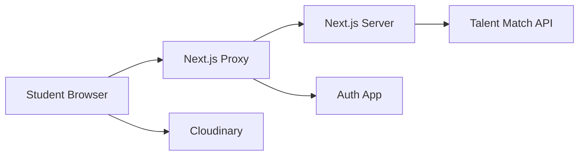

<div align="center">

# Talent Match Student V2 Security

### Frontend security policy for student sessions, cookies, API bridging, redirects, browser boundaries, and student privacy

[](#scope)
[](#cookie-security)
[](#authorization-boundary)
[](#source-review-status)

</div>

---

> [!IMPORTANT]
> The student frontend is not the final authorization boundary. Every protected student operation must be authorized by the Talent Match API using the authenticated actor and current resource state.

> [!IMPORTANT]
> The repository currently keeps access and refresh tokens in HTTP-only cookies. Preserve this design. Do not migrate them to `localStorage`, `sessionStorage`, URLs, React state, or client-readable cookies.

> [!CAUTION]
> Student profiles, applications, uploaded documents, educational history, phone numbers, and counseling-related information may be sensitive. Browser telemetry, analytics, logs, and error reporting must minimize this data.

---

## Table of contents

- [Scope](#scope)
- [Source review status](#source-review-status)
- [Security objectives](#security-objectives)
- [Security principles](#security-principles)
- [Protected assets](#protected-assets)
- [Trust boundaries](#trust-boundaries)
- [Authorization boundary](#authorization-boundary)
- [Route protection](#route-protection)
- [Server-side session enforcement](#server-side-session-enforcement)
- [Cookie security](#cookie-security)
- [Session refresh security](#session-refresh-security)
- [Logout security](#logout-security)
- [Redirect security](#redirect-security)
- [API bridge security](#api-bridge-security)
- [Bearer-token handling](#bearer-token-handling)
- [Caching and sensitive responses](#caching-and-sensitive-responses)
- [Backend error redaction](#backend-error-redaction)
- [CSRF](#csrf)
- [CORS](#cors)
- [XSS](#xss)
- [Content Security Policy](#content-security-policy)
- [Client storage](#client-storage)
- [File upload security](#file-upload-security)
- [Media security](#media-security)
- [Student data privacy](#student-data-privacy)
- [Third-party scripts and analytics](#third-party-scripts-and-analytics)
- [Environment security](#environment-security)
- [Dependency and supply-chain security](#dependency-and-supply-chain-security)
- [Security headers](#security-headers)
- [Clickjacking](#clickjacking)
- [Open redirect prevention](#open-redirect-prevention)
- [Request forgery and server-side fetches](#request-forgery-and-server-side-fetches)
- [Authentication failure behavior](#authentication-failure-behavior)
- [Role safety](#role-safety)
- [Profile rendering security](#profile-rendering-security)
- [Accessibility and security](#accessibility-and-security)
- [Logging and monitoring](#logging-and-monitoring)
- [Testing requirements](#testing-requirements)
- [Threat scenarios](#threat-scenarios)
- [Incident response](#incident-response)
- [Implemented controls](#implemented-controls)
- [Security findings and recommendations](#security-findings-and-recommendations)
- [Production checklist](#production-checklist)
- [Vulnerability reporting](#vulnerability-reporting)
- [Document maintenance](#document-maintenance)

---

## Scope

This policy applies to:

- the Next.js student application;
- page navigation;
- route interception;
- server route handlers;
- authentication cookies;
- session refresh;
- logout;
- server-to-server API calls;
- profile rendering;
- public media rendering;
- student forms and uploads;
- frontend telemetry;
- deployment configuration.

It does not replace the security policy of:

- the Talent Match API;
- the auth/public app;
- the database;
- Cloudinary;
- email providers;
- infrastructure.

---

## Source review status

### Directly reviewed source

The security review could retrieve and inspect:

- `.env.example`;
- `src/app/layout.tsx`;
- `src/components/layout/StudentWorkspaceShell.tsx`;
- `src/components/layout/StudentSidebar.tsx`;
- `src/components/layout/StudentTopNav.tsx`;
- `src/types/auth.ts`;
- `src/app/api/auth/logout/route.ts`;
- `src/app/api/auth/refresh/route.ts`;
- `src/lib/auth-cookies.ts`;
- `src/lib/session-response.ts`;
- `src/lib/env.ts`;
- `src/lib/api-client.ts`;
- `src/lib/api-error.ts`;
- `src/endpoints/auth/logout.ts`;
- `src/endpoints/auth/refresh.ts`;
- `src/proxy.ts`.

### Not retrievable in this pass

Important source still requiring inspection:

- `src/lib/student-session.ts`;
- complete student route tree;
- sidebar constants;
- package manifest;
- tests;
- CI;
- Next configuration;
- deployment manifests.

Security conclusions that depend on those files are labeled as requirements or recommendations.

---

## Security objectives

### Confidentiality

Protect:

- access token;
- refresh token;
- profile data;
- student documents;
- applications;
- contact details;
- counseling data;
- backend internal URL;
- API error internals.

### Integrity

Prevent the browser from:

- forging role;
- forging ownership;
- directly modifying protected records;
- bypassing backend workflow state.

### Availability

Maintain understandable behavior during:

- API outage;
- expired session;
- refresh failure;
- throttling;
- network failure.

### Privacy

Prevent authenticated student pages and data from:

- search indexing;
- accidental caching;
- analytics leakage;
- browser-storage leakage.

---

## Security principles

- API authorization is authoritative;
- tokens stay server-managed;
- redirects are allowlisted/local;
- sensitive data is `no-store`;
- frontend errors are redacted;
- local storage is non-sensitive only;
- `NEXT_PUBLIC_*` contains no secrets;
- session failure returns to the auth app safely;
- every student upload is validated by the backend.

---

## Protected assets

| Asset | Main risk |
|---|---|
| `tm_access` | Account/API access |
| `tm_refresh` | Long-lived session takeover |
| Student profile | PII exposure |
| Applications | Employment privacy |
| Uploaded documents | Sensitive document exposure |
| Counseling data | Highly sensitive personal data |
| API internal URL | Infrastructure exposure if misconfigured |
| Auth redirect | Phishing/open redirect |
| Cloudinary configuration | Media leakage |
| Role/profile data | Privilege confusion |

---

## Trust boundaries



The highest-risk transition is:

```text
Browser → Next.js server → API
```

because this is where cookies become backend bearer credentials.

---

## Authorization boundary

Frontend code may:

- hide unavailable actions;
- improve UX;
- prevent obvious invalid submissions.

Frontend code must never be the only place that enforces:

- `STUDENT` role;
- student ownership;
- application ownership;
- document ownership;
- university relationship;
- appointment ownership;
- opportunity eligibility;
- application state transitions.

Every mutation must be verified by the API.

---

## Route protection

`src/proxy.ts` currently:

- bypasses static assets and `/api`;
- checks whether access/refresh cookie values exist;
- allows access-cookie requests to proceed;
- sends refresh-only requests into the refresh route;
- sends unauthenticated users to the auth app.

### Security interpretation

Cookie presence is not token validity.

An attacker can create a cookie named `tm_access`.

Therefore the proxy is an **early routing optimization**, not authentication.

---

## Server-side session enforcement

The root layout calls:

```text
requireStudentSession(nextPath)
```

before rendering the workspace.

This is an important second server-side boundary.

### Required verification

Because the implementation was not retrievable in this pass, confirm that it:

- validates the access token through the trusted API/auth contract;
- requires role `STUDENT`;
- rejects inactive/suspended accounts;
- does not trust unverified JWT payload decoding alone;
- handles `401` by refresh or login safely;
- does not expose protected page content before validation.

---

## Cookie security

The current cookie helper sets:

```text
HttpOnly = true
SameSite = Lax
Path = /
Priority = High
```

and uses:

```text
Secure = AUTH_COOKIE_SECURE
```

or production-aware defaults.

### Good properties

`HttpOnly` prevents ordinary client JavaScript from reading tokens.

`SameSite=Lax` reduces many cross-site request scenarios.

Secure cookies prevent token transmission over ordinary HTTP.

### Production requirement

Use:

```dotenv
AUTH_COOKIE_SECURE=true
```

with HTTPS.

### Cookie domain

The application omits the configured domain on localhost.

In production, use the narrowest possible cookie scope.

A shared parent-domain cookie means more sibling hosts participate in session security.

---

## Session refresh security

The refresh route:

- reads the refresh token server-side;
- calls backend `/auth/refresh`;
- requires a complete returned token pair;
- writes replacement cookies;
- redirects only to a safe local student path;
- clears cookies when refresh fails.

### Security finding: refresh uses GET

The current handler is:

```text
GET /api/auth/refresh
```

yet it performs a state-changing operation by rotating/setting session credentials.

This deserves explicit review.

Risks to consider:

- link prefetch;
- intermediary assumptions about GET;
- CSRF semantics;
- accidental replay;
- concurrent browser requests.

The route does use redirect-driven navigation and no-store behavior elsewhere, but a POST-oriented refresh mechanism is generally clearer for state-changing semantics.

---

## Logout security

The browser calls:

```text
POST /api/auth/logout
```

The route attempts backend session revocation and always clears local auth cookies.

When only refresh is available, it can refresh to obtain an access token and then call backend logout.

### Positive behavior

This tries to revoke backend state rather than merely deleting browser cookies.

### Required backend guarantee

Confirm `/auth/logout` actually revokes:

- current session;
- refresh token family or intended session state.

---

## Redirect security

The refresh route validates `next` using a fixed local origin.

It rejects:

- foreign origins;
- `/api`;
- `/login`.

Fallback:

```text
/dashboard
```

This is an effective open-redirect defense for the refresh flow.

### Additional recommendation

Apply equivalent validation anywhere else that accepts:

- `next`;
- `redirect`;
- `returnTo`;
- `callbackUrl`.

---

## API bridge security

`backendJson()` and `backendFormData()` construct API URLs by joining a configured server-only base with hardcoded/controlled path values.

Requests use:

```text
cache: no-store
```

and bearer authorization only when the server supplies an access token.

### Requirement

Never accept an arbitrary absolute backend URL from browser input.

---

## Bearer-token handling

Bearer tokens are attached in server-side code:

```http
Authorization: Bearer <access-token>
```

Do not:

- send the access token to React client props;
- include it in URL parameters;
- log headers;
- expose it through browser analytics;
- store it in local storage.

---

## Caching and sensitive responses

The code uses:

```text
cache: no-store
```

for API requests.

Session-related Next.js route responses use:

```http
Cache-Control: private, no-store
```

This helps prevent sensitive auth responses from being reused by shared caches.

### Recommendation

For protected HTML pages, verify production CDN behavior does not cache personalized responses across users.

---

## Backend error redaction

`mapApiError()` suppresses messages that contain patterns associated with internal implementation details, including:

```text
prisma
sql
stack
database
exception
trace
localhost:<port>
node_modules
```

### Strength

This prevents common accidental backend detail leakage.

### Limitation

A regex cannot identify every secret or sensitive stack message.

The API must sanitize its own errors.

---

## CSRF

### Current posture

Auth cookies use `SameSite=Lax`.

That provides useful cross-site protection but is not a complete CSRF architecture for every deployment.

### Review state-changing route handlers

For any cookie-authenticated frontend route:

- require POST/PATCH/DELETE;
- validate `Origin` or use CSRF tokens where appropriate;
- avoid state change over GET;
- keep SameSite restrictive;
- do not use wildcard CORS with credentials.

The current GET refresh route deserves special review.

---

## CORS

Browser code should communicate with the student origin whenever possible and let server-side route handlers talk to the internal API.

The Talent Match API should allow only intended frontend origins.

Never expose:

```text
Access-Control-Allow-Origin: *
```

together with credentials.

---

## XSS

HTTP-only cookies reduce token theft from XSS, but XSS remains dangerous because malicious script can act as the logged-in student.

Controls:

- React escaping;
- avoid `dangerouslySetInnerHTML`;
- sanitize rich text;
- CSP;
- dependency hygiene;
- trusted URL handling;
- no secrets in client state.

---

## Content Security Policy

A production CSP should constrain:

- scripts;
- styles;
- images;
- connections;
- frames;
- form actions;
- object sources.

Cloudinary and the required API/socket hosts should be explicitly allowlisted.

Avoid broad `*` sources.

---

## Client storage

The sidebar stores only:

```text
tm_student_sidebar_state
```

in `localStorage`.

The source comment explicitly identifies it as a layout preference containing no session information.

Maintain this rule.

Do not store:

- tokens;
- profile PII;
- applications;
- document content;
- appointment details.

---

## File upload security

The API client supports `FormData`.

Every upload endpoint must enforce server-side:

- content-length/file-size limit;
- magic-byte MIME validation;
- file type allowlist;
- malware scanning where appropriate;
- ownership authorization;
- generated storage key;
- image/document processing;
- metadata minimization.

Frontend `accept=` attributes are UX only.

---

## Media security

`NEXT_PUBLIC_MEDIA_PUBLIC_BASE_URL` is browser-visible.

Only intended public images should be rendered through public Cloudinary URLs.

Student CVs, certificates, identity files, and private supporting documents should use:

- private/authenticated storage;
- signed short-lived URLs;
- API authorization.

---

## Student data privacy

Potentially sensitive student data includes:

- name;
- phone number;
- email;
- university details;
- education history;
- CV;
- applications;
- counseling appointments;
- documents.

Use data minimization in:

- client props;
- page source;
- logs;
- analytics;
- crash reporting.

---

## Third-party scripts and analytics

Before adding analytics:

- document data collected;
- disable form-field capture;
- redact URLs/query strings;
- exclude auth tokens;
- avoid session replay on sensitive forms;
- obtain required consent.

Do not load unnecessary third-party scripts on authenticated pages.

---

## Environment security

Source-confirmed public variables:

```text
NEXT_PUBLIC_STUDENT_APP_URL
NEXT_PUBLIC_AUTH_APP_URL
NEXT_PUBLIC_API_SOCKET_URL
NEXT_PUBLIC_MEDIA_PUBLIC_BASE_URL
```

Everything prefixed `NEXT_PUBLIC_` must be assumed public.

Server-only values:

```text
API_INTERNAL_URL
AUTH_ACCESS_COOKIE_NAME
AUTH_REFRESH_COOKIE_NAME
AUTH_COOKIE_DOMAIN
AUTH_COOKIE_SECURE
```

Do not place API credentials into public variables.

---

## Dependency and supply-chain security

Require:

- lockfile committed;
- dependency scanning;
- secret scanning;
- minimal packages;
- review of postinstall scripts;
- controlled upgrades;
- Node.js version policy;
- npm provenance where available.

High-risk packages include:

- auth/session helpers;
- markdown/rich text renderers;
- file parsers;
- image processors.

---

## Security headers

Production should verify:

```text
Strict-Transport-Security
Content-Security-Policy
X-Content-Type-Options: nosniff
Referrer-Policy
Permissions-Policy
```

Use CSP `frame-ancestors` for clickjacking protection.

---

## Clickjacking

Authenticated student pages should not be embedded by arbitrary origins.

Use:

```text
Content-Security-Policy: frame-ancestors 'none'
```

or approved origins only.

---

## Open redirect prevention

The refresh implementation already validates the local return path.

Replicate this pattern for all redirect-related parameters.

Never use:

```ts
window.location.assign(userInput)
```

without validation.

---

## Request forgery and server-side fetches

Server-side API helpers should use fixed trusted bases.

If future functionality fetches URLs supplied by users:

- do not fetch arbitrary URLs directly;
- block private/loopback/link-local ranges;
- enforce scheme and host allowlists;
- limit redirects and response size.

---

## Authentication failure behavior

Expected behavior:

### No session

Redirect:

```text
auth app /login
reason=student_session_required
```

### Refresh failure

Clear cookies and redirect with:

```text
reason=student_session_expired
```

### Explicit logout

Redirect with:

```text
reason=signed_out
```

These reason values are non-sensitive and appropriate for UX messaging.

---

## Role safety

The frontend type includes multiple roles.

The student portal must ensure a valid authenticated account is actually a student before protected workspace rendering.

Do not rely on:

- the route hostname;
- frontend profile label;
- navigation visibility.

The session guard/API must enforce role.

---

## Profile rendering security

The top navigation builds a display label from:

1. profile display name;
2. account name;
3. email;
4. `"Talent Match Student"`.

React text rendering escapes the display value by default.

If future profile fields render HTML or markdown, sanitize them.

---

## Accessibility and security

Accessible security flows reduce unsafe workarounds.

Current positive patterns include:

- keyboard Escape support;
- dialog semantics;
- explicit labels;
- role alert for errors;
- descriptive buttons.

Keep MFA, logout, and session-expiry flows fully keyboard and screen-reader accessible.

---

## Logging and monitoring

Safe fields:

- request ID;
- route;
- status;
- latency;
- hashed/non-sensitive user ID if approved;
- auth event category.

Never log:

- cookie headers;
- tokens;
- CVs/documents;
- full form submissions;
- sensitive API payloads.

Alert on:

- refresh failures spike;
- unusual `401`;
- unusual `403`;
- repeated logout errors;
- `429` spike;
- session loops;
- API `5xx`.

---

## Testing requirements

### Authentication integration

- access token success;
- refresh success;
- refresh failure;
- logout;
- access-role rejection;
- backend unavailable.

### Cookie tests

Assert:

```text
HttpOnly
SameSite=Lax
Secure in production
correct Path
correct Domain
expiry
```

### Redirect tests

- local path;
- external absolute URL;
- protocol-relative URL;
- `/api`;
- `/login`;
- encoded path;
- malformed path.

### CSRF tests

Review every cookie-authenticated mutation.

### XSS tests

Test user-controlled:

- display name;
- profile details;
- opportunity content;
- employer content;
- resources.

### Upload tests

- oversized;
- wrong MIME;
- polyglot;
- unsupported extension;
- unauthorized record.

---

## Threat scenarios

### Attacker creates a fake `tm_access` cookie

The proxy allows navigation based on presence.

Mitigation:

- root server session guard;
- API authentication;
- student-role check.

### Refresh token stolen

Risk:

- long-lived student-session takeover.

Mitigations required in backend:

- rotation;
- reuse detection;
- session revocation;
- short access-token TTL.

### Malicious external `next` URL

Mitigation implemented in refresh:

- fixed local origin;
- local path only;
- safe fallback.

### XSS occurs

HTTP-only cookies reduce direct token extraction, but the script can still submit requests.

Mitigations:

- CSP;
- sanitization;
- React escaping;
- dependency controls;
- backend authorization.

### Subdomain compromised

If cookies use a broad shared domain, sibling hosts can affect the trust model.

Mitigation:

- narrow cookie scope;
- secure every sibling host;
- host-only cookies where possible.

### Backend leaks stack trace

Frontend heuristic filtering helps, but backend must sanitize.

### API unavailable

API client returns safe `503` payload rather than internal network details.

---

## Incident response

### Suspected student session theft

1. revoke affected session/token family in backend;
2. force re-authentication;
3. inspect auth and API audit;
4. notify student when appropriate;
5. investigate refresh-token reuse;
6. rotate secrets only if systemic exposure exists.

### XSS incident

1. deploy CSP/block vector;
2. remove malicious content/dependency;
3. revoke active sessions if needed;
4. investigate affected accounts;
5. review sensitive actions;
6. notify.

### Cookie-domain compromise

1. isolate compromised sibling host;
2. narrow or rotate cookie scope;
3. revoke sessions;
4. inspect cross-subdomain cookie injection;
5. restore trusted host.

### Auth redirect compromise

1. remove unsafe target;
2. audit phishing exposure;
3. invalidate compromised links;
4. add allowlist tests.

---

## Implemented controls

Source-confirmed:

- HTTP-only access and refresh cookies;
- SameSite=Lax;
- production-aware Secure cookies;
- high cookie priority;
- session cookie clearing;
- server-side backend bearer forwarding;
- refresh safe-next validation;
- refresh failure cookie clearing;
- backend logout attempt;
- no-store backend fetches;
- private/no-store auth route responses;
- internal error redaction;
- no student auth token in local storage;
- root server session requirement;
- search-engine indexing disabled.

---

## Security findings and recommendations

### Medium — state-changing refresh uses GET

Review or move credential rotation to a POST route while preserving redirect UX.

### Medium — proxy only checks cookie presence

Ensure `requireStudentSession` and the API perform cryptographic/session validation and student-role enforcement on every protected render.

### Medium — secure cookie can be explicitly disabled

Production deployment validation should reject:

```text
AUTH_COOKIE_SECURE=false
```

when the student app is HTTPS.

### Medium — shared cookie domain broadens trust

Use the narrowest domain possible.

### Low — frontend error sanitization is heuristic

Treat as defense in depth only.

### Review needed — CSRF architecture

Audit every Next.js mutation route that relies on cookies.

### Review needed — complete route coverage

Inspect student domain route handlers and forms for direct client API calls, unsafe caching, or client-side token exposure.

---

## Production checklist

- [ ] HTTPS only
- [ ] `AUTH_COOKIE_SECURE=true`
- [ ] cookie domain minimized
- [ ] root session guard verified
- [ ] student role verified server-side
- [ ] backend authorization verified
- [ ] refresh concurrency tested
- [ ] CSRF posture reviewed
- [ ] CSP deployed
- [ ] HSTS deployed
- [ ] frame-ancestors configured
- [ ] no secrets in `NEXT_PUBLIC_*`
- [ ] no tokens in local/session storage
- [ ] sensitive API responses no-store
- [ ] error reporting redacts PII
- [ ] upload routes validated
- [ ] dependency/secret scans enabled
- [ ] auth E2E tests pass

---

## Vulnerability reporting

Add the organization’s actual private security contact.

Recommended:

```text
SECURITY_CONTACT=TBD
STUDENT_PORTAL_OWNER=TBD
INCIDENT_ON_CALL=TBD
```

Do not report authentication or student-data vulnerabilities in a public GitHub issue.

---

## Document maintenance

Update this policy when:

- cookie behavior changes;
- session refresh changes;
- the auth app changes;
- a new browser API route is added;
- a new upload feature is added;
- CSP or security headers change;
- student roles change;
- a security incident occurs.

Review before every major production release.

---

<div align="center">

Talent Match Student V2 is safest when the browser remains a presentation layer, credentials remain server-managed, and the Talent Match API remains the final authorization authority.

</div>
